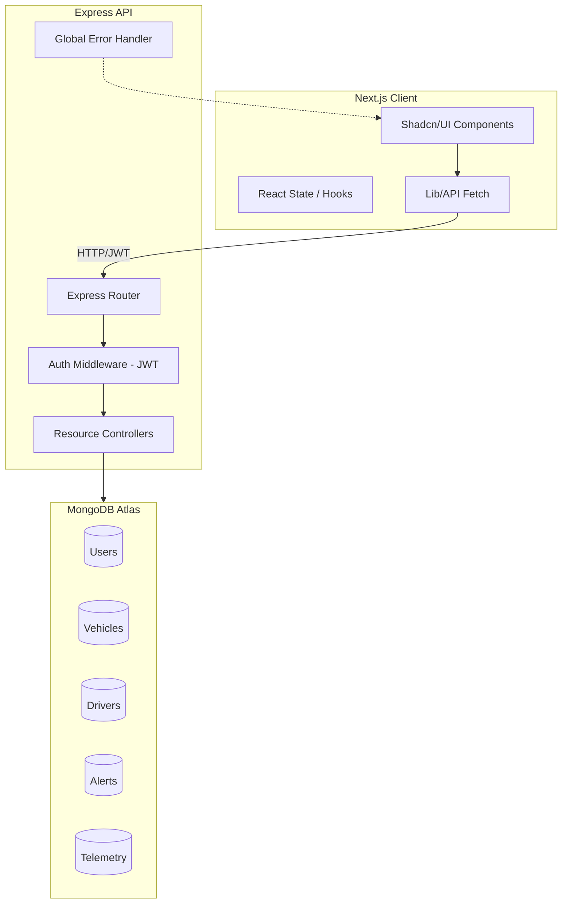

# 🔋 FleetPulse AI - Intelligent Fleet Management

FleetPulse AI is a comprehensive, professional-grade platform designed for real-time tracking, driver analytics, and automated alerting for large-scale fleet operations. This project showcases a modern, full-stack architecture with a focus on performance, security, and premium user experience.

## ✨ Live Demo
[**Click here to view the Live Dashboard**](https://fleetpulse-ai.vercel.app) 🚀

---

## 🎨 System Visualization


## 🏗️ Technical Architecture



---

## 🔐 Key Features

- **Real-time Monitoring**: Visual fleet map with live status updates and geolocation tracking.
- **Advanced Authentication**: JWT-based secure auth with Role-Based Access Control (RBAC).
- **Proactive Alerting**: Automated critical and maintenance alerts based on vehicle telemetry.
- **Deep Analytics**: Dynamic KPI dashboards for fuel efficiency, vehicle uptime, and driver behavior.
- **Premium Design**: Modern, glassmorphic dark-mode interface built for operational efficiency.

---

## 📁 Project Structure

```text
fleetpulse-ai/
├── backend/                # Express.js API
│   ├── src/
│   │   ├── controllers/    # Business logic
│   │   ├── models/         # Mongoose schemas
│   │   ├── routes/         # API endpoints
│   │   └── middlewares/    # Auth & security
│   └── package.json
└── fleetpulse-frontend/    # Next.js Dashboard
    ├── app/                # App Router (Dashboard modules)
    ├── components/         # Shadcn/UI & Charts
    ├── lib/                # API service layer
    └── package.json
```

---

## 🚀 Getting Started

### Backend Setup

1. Navigate to `/backend`
2. Install dependencies: `npm install`
3. Configure `.env`:
   ```env
   PORT=5000
   DATABASE_URL=your_mongodb_url
   JWT_SECRET=your_secret
   ```
4. Start server: `npm run dev`

### Frontend Setup

1. Navigate to `/fleetpulse-frontend`
2. Install dependencies: `npm install`
3. Configure `.env.local`:
   ```env
   NEXT_PUBLIC_API_URL=http://localhost:5000/api
   ```
4. Start dashboard: `npm run dev`

---

Developed with ❤️ by Venkata Subbaiah.