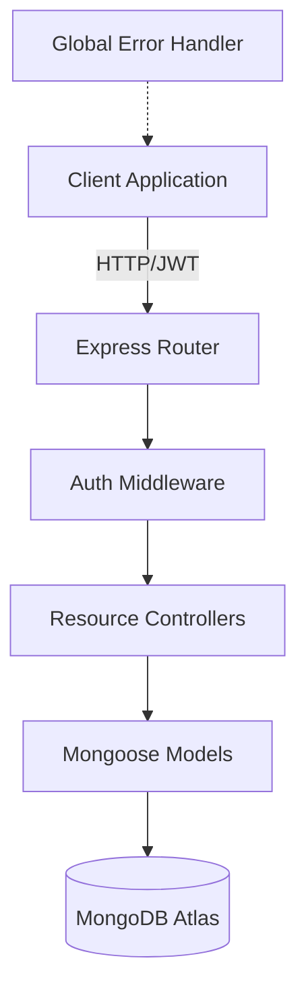

# 🚀 FleetPulse AI - Backend 

Professional fleet management backend powered by **Node.js**, **Express**, and **MongoDB**. This system handles real-time telemetry processing, driver analytics, and automated alerting for large-scale fleet operations.

## 🛠️ Tech Stack

- **Runtime**: Node.js
- **Framework**: Express.js
- **Database**: MongoDB (via Mongoose)
- **Security**: JWT (Authentication), Helmet (Security Headers), Rate Limiting, Mongo Sanitize
- **Validation**: Zod (Schema Validation)
- **Logging**: Morgan

## 🏗️ Architecture



## 🔐 Key Features

- **JWT Authentication**: Secure signup/login with encrypted password storage (bcrypt).
- **Role-Based Access Control (RBAC)**: Distinct permissions for `admin`, `dispatcher`, and `user`.
- **Telemetry Processing**: Ingestion and indexing of vehicle location, fuel, and speed data.
- **Automated Alerts**: System-wide notifications based on vehicle status and telemetry.
- **Analytics Engine**: Pre-aggregated KPIs for total vehicles, active fleet, and fuel efficiency.

## 🚀 Getting Started

### Prerequisites

- Node.js (v18+)
- MongoDB Atlas account or local MongoDB instance

### Installation

1. Clone the repository:
   ```bash
   git clone https://github.com/your-username/fleetpulse-backend.git
   cd fleetpulse-backend
   ```

2. Install dependencies:
   ```bash
   npm install
   ```

3. Configure environment variables:
   Create a `.env` file in the root and add:
   ```env
   PORT=5000
   NODE_ENV=development
   DATABASE_URL=your_mongodb_connection_string
   JWT_SECRET=your_super_secret_key
   JWT_EXPIRE=90d
   ```

4. Start the server:
   ```bash
   npm run dev
   ```

## 📡 API Endpoints

| Method | Endpoint | Description | Auth |
| :--- | :--- | :--- | :--- |
| POST | `/api/auth/signup` | Register a new user | No |
| POST | `/api/auth/login` | Login and get JWT | No |
| GET | `/api/vehicles` | List all vehicles | Yes |
| GET | `/api/drivers` | List all drivers | Yes |
| GET | `/api/alerts` | List all active alerts | Yes |
| GET | `/api/analytics` | Get dashboard KPIs | Yes |

---

Developed with ❤️ for the Fleet Management Industry.
