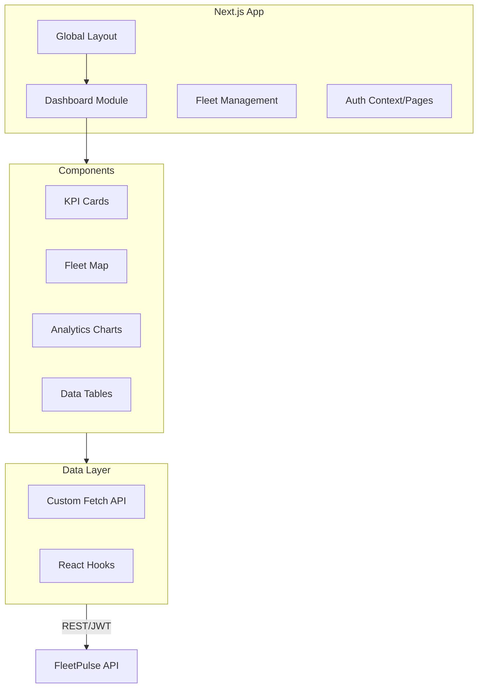

# 🌐 FleetPulse AI - Live Dashboard

A high-performance, real-time fleet management dashboard built with **Next.js**, **Tailwind CSS**, and **Shadcn/UI**. This frontend provides dispatchers and fleet managers with a single pane of glass for monitoring vehicle health, driver behavior, and operational efficiency.

## ✨ Live Demo
[**Click here to view the Live Demo**](https://fleetpulse-ai.vercel.app) 🚀

---

## 🎨 Premium Visuals


## 🛠️ Tech Stack

- **Framework**: Next.js 16 (App Router)
- **Styling**: Tailwind CSS
- **Components**: Shadcn/UI
- **Charts**: Recharts
- **Icons**: Lucide React
- **Maps**: Mapbox GL / Custom Canvas
- **Animation**: Tailwind Animate / CSS Micro-animations

## 🏗️ Architecture



## 🚀 Key Features

- **Real-time Map**: Visual tracking of entire fleet with live status updates.
- **KPI Dashboard**: Instant visibility into active vehicles, today's alerts, and fuel metrics.
- **Smart Alerting**: Visual indicators for critical, high, and maintenance-related events.
- **Premium Dark Mode**: Aesthetic, high-contrast interface designed for long-shift operational use.
- **Responsive Design**: Fully optimized for desktop, tablet, and mobile views.

## 🚀 Getting Started

### Prerequisites

- Node.js (v18+)
- Backend API URL (Running or Mock)

### Installation

1. Clone the repository:
   ```bash
   git clone https://github.com/your-username/fleetpulse-frontend.git
   cd fleetpulse-frontend
   ```

2. Install dependencies:
   ```bash
   npm install
   ```

3. Configure environment variables:
   Create a `.env.local` file in the root and add:
   ```env
   NEXT_PUBLIC_API_URL=http://localhost:5000/api
   ```

4. Start the development server:
   ```bash
   npm run dev
   ```

---

Developed with ❤️ for the Fleet Management Industry.
