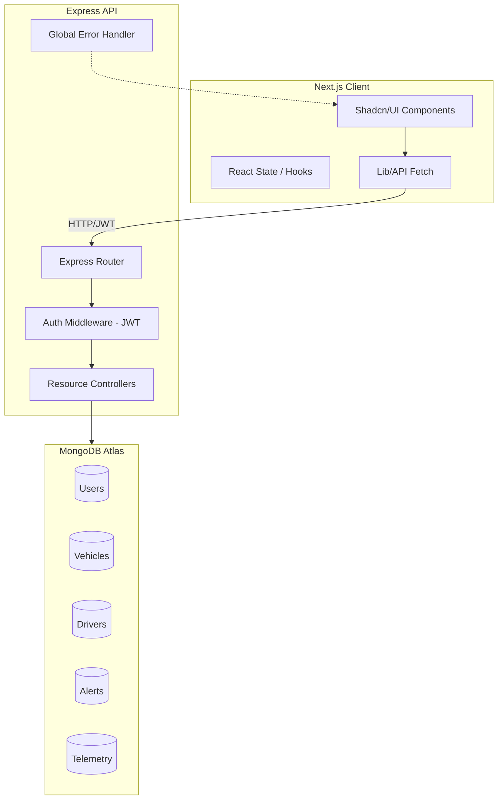
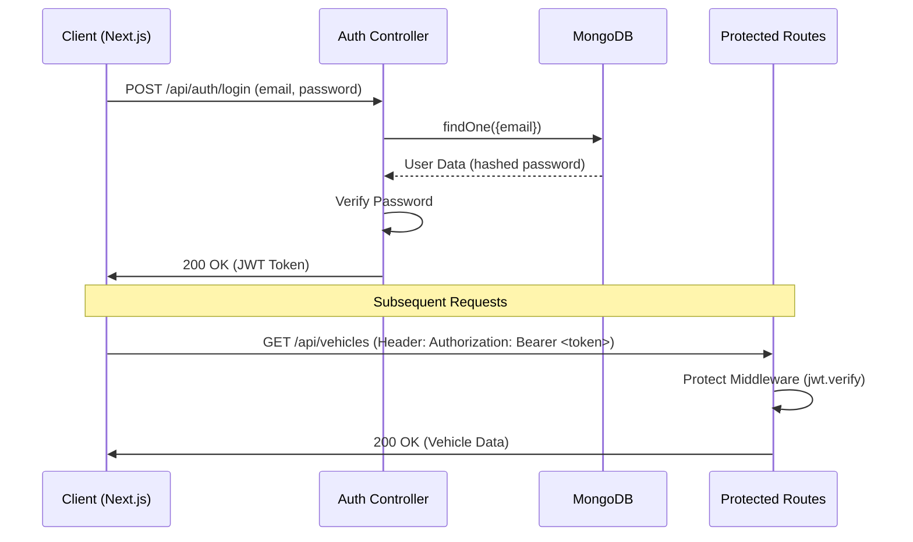
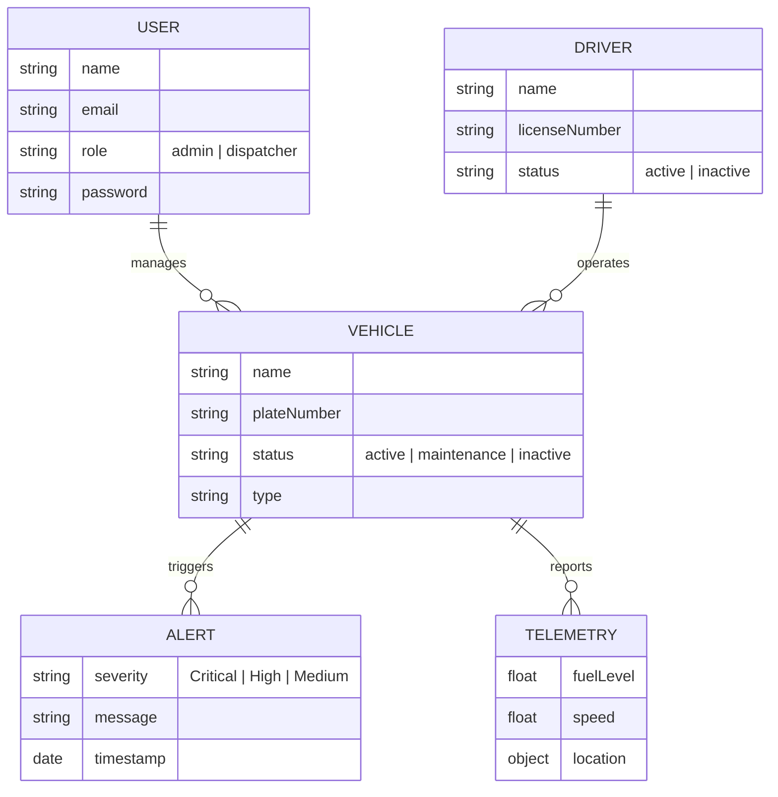

# FleetPulse AI - Project Visualization

FleetPulse AI is a modern fleet management platform designed to provide real-time tracking, driver analytics, and automated alerting.

## 🏗️ System Architecture

The application follows a classic Client-Server architecture with a decoupled frontend and backend.

---

## 🔐 Authentication Flow

The system uses JSON Web Tokens (JWT) for secure communication and Role-Based Access Control (RBAC).

---

## 📊 Data Relationships

The data model is centered around Vehicles and their associated telemetry and oversight.

---

## 📂 Module Map

### Backend (`/backend/src`)
- **Controllers**: Logic for each resource (Auth, Vehicle, Driver, etc.).
- **Models**: Mongoose schemas for MongoDB.
- **Routes**: API endpoint definitions.
- **Middlewares**: Auth protection, Rate limiting, Security headers.
- **Utils**: Global error handling and shared utilities.

### Frontend (`/fleetpulse-frontend`)
- **app/**: Next.js App Router folders (Dashboard, Alerts, Fleet).
- **components/**: UI components (Shadcn/UI) and Dashboard-specific charts (Recharts).
- **lib/**: API service layer and utility functions.
- **public/**: Static assets.
